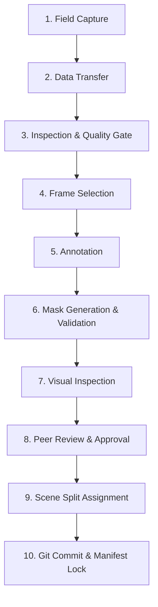

# StepView — Bootstrap Data Acquisition & Annotation Workflow

**Version:** 1.0  
**Date:** 2026-09-24  
**Target:** Ingestion of Initial 20–30 Real-Terrain Validation Samples

---

## 1. Scope & Purpose of Bootstrap Data

The immediate objective of the bootstrap dataset is to establish a verified, end-to-end data pipeline with **20–30 real-world terrain frames**.

> [!CAUTION]
> **Capacity Limitation Notice:**  
> A dataset of 20–30 frames is **strictly intended to validate pipeline mechanics**:
> 1. Real image and mask file format compatibility.
> 2. Annotation tool output conversion.
> 3. Validation and visualization via `scripts/visualize_dataset.py`.
> 4. Class distribution inspection.
> 5. PyTorch DataLoader memory and batch execution.
>
> 20–30 samples are **NOT** sufficient to train a production deep learning model. Production training will require scaled data collection and supplemental dataset ingestion (Phases 1 and 2).

---

## 2. 10-Step Operational Workflow



### Step 1: Field Capture
* **Equipment:** Standard smartphone (iOS or Android) recording at 1080p/4K @ 30 or 60 FPS, or high-res still photos.
* **Camera Orientation:** Handheld or chest mount at ~1.0–1.4m height, pitched downward at 35°–50° relative to horizontal.
* **Walking Speed:** Normal walking pace (1.0–1.5 m/s).
* **Target Scenes for Bootstrap (4–6 scenes, 5 frames each):**
  * Scene 1: Flat dirt/compacted soil trail.
  * Scene 2: Rocky/uneven path with protruding stones.
  * Scene 3: Woodland trail with exposed roots and leaf litter.
  * Scene 4: Sloped trail with gravel or loose scree.
  * Scene 5: Shaded path with harsh sunlight dappling.
  * Scene 6: Trail with drop-off or erosion ditch edge.

### Step 2: Data Transfer
* Transfer raw videos/images to `data/raw/` preserving original capture timestamps and camera metadata.

### Step 3: Frame Extraction & Quality Gate
* Extract candidate frames at intervals that avoid motion blur.
* Reject frames exhibiting:
  * Severe camera shake / motion blur.
  * Extreme lens flare wiping out ground visibility.
  * The user's shoes or body blocking more than 15% of the frame.

### Step 4: Frame Selection (20–30 Frames)
* Select 20–30 representative frames across the captured scenes.
* Resize/standardize frames to 1280×720 (or target resolution) and save as `data/images/{scene_id}_frame{XXXX}.jpg`.

### Step 5: Annotation Execution
* Open images in the selected local annotation tool (see Section 3 below).
* Label polygons adhering to [docs/10_ANNOTATION_GUIDELINES.md](file:///Users/mns/Mns_Data/code/AiMl/StepViewProject/docs/10_ANNOTATION_GUIDELINES.md):
  * `0`: Background
  * `1`: Ground
  * `2`: Obstacle
  * `3`: Vegetation
  * `4`: Hole
  * `5`: Uncertain Surface

### Step 6: Mask Export & Validation
* Render annotations to single-channel 8-bit PNG masks at `data/masks/{scene_id}_frame{XXXX}.png`.
* Run automated validation:
  ```bash
  .venv/bin/python -c "import cv2, numpy as np; from stepview.data.schema import validate_mask_classes; mask = cv2.imread('data/masks/scene001_frame0001.png', cv2.IMREAD_UNCHANGED); validate_mask_classes(mask); print('Mask valid!')"
  ```

### Step 7: Visual Inspection
* Run the StepView visualization tool:
  ```bash
  .venv/bin/python scripts/visualize_dataset.py --data-dir data --split all --save-dir experiments/visualizations/bootstrap
  ```
* Verify:
  * Image/mask resolution matches.
  * Overlay boundaries align with real physical terrain features.
  * Class percentages are balanced and plausible.

### Step 8: Review & Quality Sign-Off
* Review inspection output images. Fix any mislabeled polygons or label bleed.

### Step 9: Split Assignment & Manifest Generation
* Partition samples into `splits/train.txt` and `splits/val.txt` strictly by `scene_id`.
* Update `data/metadata/manifest.json`.

### Step 10: Version Control Commit
* Commit metadata, splits, and manifest to Git:
  ```bash
  git add data/metadata/ data/splits/ docs/
  git commit -m "data(bootstrap): add verified bootstrap dataset metadata and splits"
  ```
* (Raw binaries in `data/images/` and `data/masks/` are tracked or archived according to data storage policy).

---

## 3. Annotation Tooling Evaluation & Recommendation

To prevent premature infrastructure bloat, we avoid building a custom annotation web app.

### Evaluation of Existing Local Tools:

| Tool | Deployment | Advantages | Limitations | Recommendation |
|---|---|---|---|---|
| **Labelme** | Python CLI (`pip install labelme`) | Lightweight, runs locally offline, cross-platform, JSON polygon output easily converted to PNG masks. | Manual polygon drawing, no AI auto-segmentation out of the box. | **Recommended for Bootstrap (< 50 frames)** |
| **CVAT (Local)** | Docker container | Robust, multi-user, supports direct segmentation mask export. | Requires Docker setup and resource overhead. | Good for large team scaling |
| **AnyLabeling** | Desktop binary / pip | Embedded Segment Anything (SAM) model for 1-click polygon generation. | Slightly heavier install. | Excellent for accelerating manual polygons |

### Recommended Workflow for StepView Bootstrap:
1. Use **Labelme** or **AnyLabeling** on the local machine.
2. Configure labels in tool: `background`, `ground`, `obstacle`, `vegetation`, `hole`, `uncertain_surface`.
3. Export polygons to JSON.
4. Convert JSON polygons to 8-bit indexed PNG masks matching `stepview.data.schema.TerrainClass` mapping.
