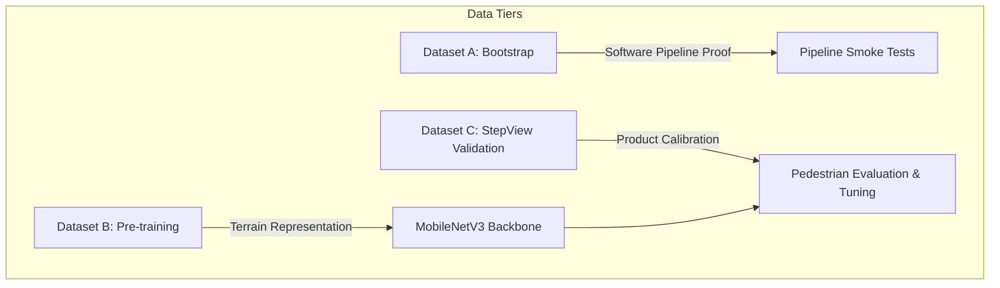

# StepView — Multi-Tier Training Data & Model Strategy

**Version:** 1.0  
**Date:** 2026-09-24  
**Applies to:** ML Model Architecture, Training Pipeline, and Dataset Roles

---

## 1. Three Distinct Dataset Roles

To maintain strict scientific rigor and avoid premature claims, data assets are decoupled into three distinct tiers:



### 1.1 Dataset A — Bootstrap (Current 26 Samples)
* **Description:** The 26 converted RUGD frames across 18 scenes in `data/images/` and `data/masks/`.
* **Primary Role:** **Software engineering verification and pipeline smoke tests.**
* **Intended Use:**
  * Verifying DataLoader batching, tensor dtypes, and transformations.
  * Verifying forward pass, loss calculation, backward pass, and optimizer steps.
  * Testing checkpoint serialization, deserialization, and export mechanics.
  * Verifying visualization and diagnostic scripts.
* **Strict Constraint:** **NEVER report metrics on Dataset A as meaningful ML model performance.** With 16 training and 5 validation frames, any high metric indicates training memorization, not generalization.

### 1.2 Dataset B — Segmentation Pre-training (Scaled RUGD)
* **Description:** A substantially larger curated subset of RUGD (e.g. 500–1,500 frames) sampled across varied trail, creek, forest, and park sequences.
* **Source:** Official RUGD repository (`http://rugd.vision/`, US Army Research Laboratory).
* **Licensing:** Academic / Non-Commercial Research License.
* **Citation:** Wigness, M., Eum, S., Rogers, J. G., Han, D., & Kwon, H. (2019). *A Robot Unstructured Ground Driving (RUGD) Dataset for Semantic Segmentation in Natural Environments.* IEEE/RSJ IROS.
* **Role:** **Visual feature representation pre-training.**
* **Utility:** Teaches the deep convolutional encoder to distinguish outdoor terrain textures (soil, grass, rocks, tree canopy, water, sky, asphalt).
* **Known Limitations:**
  * Robot platform viewpoint (~0.6m height, ~15° pitch).
  * 0% representation of StepView Class 4 (`HOLE`).

### 1.3 Dataset C — StepView Validation (Pedestrian Smartphone Data)
* **Description:** Pedestrian-captured walking videos and frames recorded using handheld/chest-mounted smartphones.
* **Role:** **Product ground-truth validation and fine-tuning.**
* **Specifications:**
  * Downward camera pitch: 35°–50° relative to horizontal.
  * Camera height: 1.0–1.4m.
  * Target terrain: Hiking paths, roots, protruding boulders, loose scree, wet leaves, erosion drop-offs (`HOLE`).
  * Annotations: Dense 6-class segmentation conforming to [docs/10_ANNOTATION_GUIDELINES.md](file:///Users/mns/Mns_Data/code/AiMl/StepViewProject/docs/10_ANNOTATION_GUIDELINES.md).

---

## 2. Progressive Training Workflow

To prevent domain collapse and guarantee clear error attribution, training proceeds through distinct sequential phases:

```text
Phase 2A: RUGD Semantic Pre-training (Dataset B)
         ↓  (Encoder learns general outdoor textures)
Phase 2B: StepView Smartphone Fine-Tuning (Dataset C - Train split)
         ↓  (Model adapts to downward 35°–50° angle and detects holes/roots)
Phase 2C: StepView Held-Out Evaluation (Dataset C - Val/Test splits)
         ↓  (Evaluated on unseen pedestrian trails)
Phase 3:  Candidate Foot-Placement Generation & Spatial Scoring
         ↓  (Converts segmentation masks into ranked footstep landing regions)
```

---

## 3. Class Availability & The Missing `HOLE` Class

* In Dataset A and Dataset B (RUGD), StepView Class 4 (`HOLE`) is **completely absent (0% pixels)** because the original RUGD ontology does not annotate drop-offs or pits.
* **Policy Rules:**
  1. **Do Not Manufacture Fake Labels:** No artificial holes will be synthesized into RUGD masks.
  2. **Absent-Class Handling:** Evaluation metrics (such as Mean IoU) must dynamically report both:
     * *All-Class mIoU:* Across classes 0..5.
     * *Active-Class mIoU:* Computed strictly over classes present in the ground-truth validation set.
  3. **Loss Computation:** Cross-entropy loss will naturally penalize false-positive hole predictions if any occur, but loss masking is supported when training exclusively on datasets with partial taxonomies.

---

## 4. Configurable Class Weighting Strategy

In RUGD, vegetation dominates 61.37% of pixels, while obstacles occupy only 2.89% and ground occupies 12.56%. Naive unweighted training leads to a trivial local minimum where the model predicts vegetation everywhere, achieving 60%+ accuracy while failing to detect walkable ground or obstacles.

StepView implements **configurable class weighting** in loss computation:

$$\text{Weight}_c = \text{median\_freq\_weight}(c) = \frac{\text{median}(\{f_i\})}{f_c + \epsilon}$$

Where $f_c = \frac{\text{pixels}_c}{\text{total\_pixels}}$.

The trainer supports:
* `weight_mode = "none"`: Uniform loss weights $(1.0, 1.0, \dots, 1.0)$.
* `weight_mode = "median_freq"`: Dynamically calculated from dataset `class_stats.json`.
* `weight_mode = "custom"`: Explicit user-specified weight vector (e.g. upweighting ground and obstacle).

---

## 5. Critical Separation: Segmentation vs. Foot Placement

> [!IMPORTANT]
> **Core Engineering Distinction:**
> * **Semantic Segmentation Metric (Phase 2):**  
>   "Did the model classify the pixels correctly?"  
>   Measured by: Intersection-over-Union (IoU), Precision, Recall, Confusion Matrix.
> * **Foot-Placement Recommendation Metric (Phase 3+):**  
>   "Did the system identify a geometrically sound, obstacle-free, visually stable region large enough for an adult foot?"  
>   Measured by: Candidate False Recommendation Rate (FRR) on held-out human-annotated footstep targets.
>
> High segmentation IoU is necessary for spatial reasoning, but does **not** equal safety or footstep validity.
